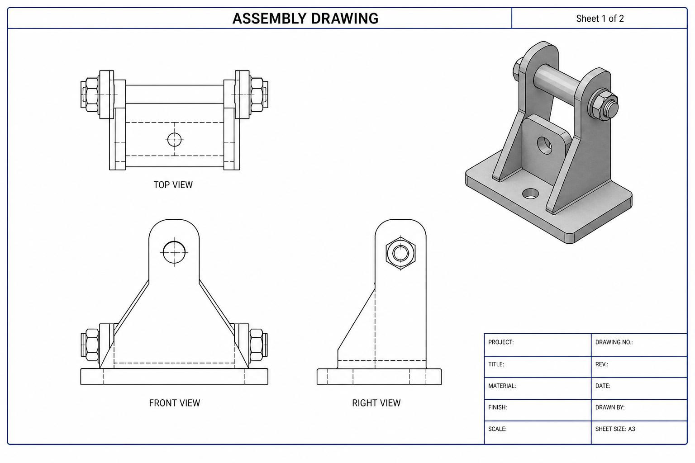
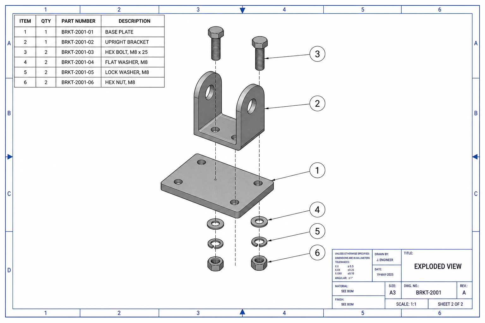

# SolidWorks Drawing Macros

VBA macros that create SolidWorks drawings (`.SLDDRW`) from Parts and Assemblies, then export **PDF** and **PNG** previews.

## What you get

| Macro | Purpose |
| --- | --- |
| `macros/CreateDrawing.bas` | Create a drawing from the **active** Part/Assembly |
| `macros/BatchCreateDrawings.bas` | Create drawings for every Part/Assembly in a **folder** |

Each drawing includes:

- 3rd-angle standard views (Front / Top / Right) + shaded isometric
- For **assemblies**:
  - **AutoExplode** (or an existing named explode)
  - Exploded isometric on sheet **Exploded**
  - Bill of Materials
  - **Auto-balloons** on the exploded view
- Exports next to the model:
  - `<Name>.SLDDRW`
  - `<Name>.pdf` (all sheets)
  - `<Name>_Sheet1.png`, `<Name>_Exploded.png`, …

## Output preview (what the sheets look like)

### Sheet 1 — standard views



### Sheet 2 — AutoExplode + Auto Balloons



Sample multi-page PDF (illustrative layout): [`output/sample-assembly-drawing.pdf`](output/sample-assembly-drawing.pdf)

> These previews illustrate the intended layout. Running the macro in SolidWorks produces the real `.pdf` / `.png` files from your model.

## Install (SolidWorks)

**Recommended (paste — avoids `Attribute VB_Name` errors):**

1. Open SolidWorks → open your Part/Assembly → save it.
2. **Tools → Macro → New…** → save as `CreateDrawing.swp`.
3. In the VBA editor, **delete all default code** in `Module1`.
4. Open `macros/CreateDrawing.bas` in Notepad → **copy all** → paste into `Module1`.
5. If the first line is `Attribute VB_Name = "CreateDrawing"`, **delete that line**.
6. Optional: set `DRAWING_TEMPLATE_PATH` to your `.drwdot`.
7. Save → close the editor.
8. **Tools → Macro → Run…** → choose `CreateDrawing.swp` → `main`.

**Or import the `.bas` file:** VBA editor → **File → Import File…** → `CreateDrawing.bas`  
(Import keeps `Attribute VB_Name`; pasting into Module1 does not allow that line.)

### Troubleshooting: `Attribute VB_Name = "CreateDrawing"` error

SolidWorks creates `Module1` when you use Macro → New. Pasting `Attribute VB_Name = ...` into that module causes a compile error. **Remove that line** and keep everything from `Option Explicit` / the header comments downward.

### Run

1. Open a saved Part or Assembly.
2. **Tools → Macro → Run…** → `CreateDrawing.swp` → `main`
3. Check the model folder for `.SLDDRW`, `.pdf`, and `.png` files.

## Configuration

```vb
' Assembly
ADD_EXPLODED_VIEW = True
AUTO_CREATE_EXPLODE = True
FORCE_AUTO_EXPLODE = False      ' True = always AutoExplode
ADD_AUTO_BALLOONS = True
ADD_BOM_FOR_ASSEMBLY = True
PREFERRED_EXPLODE_NAME = ""
BALLOON_LAYOUT = 1              ' Square

' Export
EXPORT_PDF = True
EXPORT_IMAGES = True
IMAGE_EXTENSION = "png"         ' png | jpg | tif | bmp
```

## Requirements

- SolidWorks with VBA macros enabled
- Model saved on disk before running
- For best explode results, keep a curated named explode and set `PREFERRED_EXPLODE_NAME` (AutoExplode is the automatic fallback)

## Rebuild sample PDF (optional)

```bash
python3 scripts/build_sample_pdf.py
```
